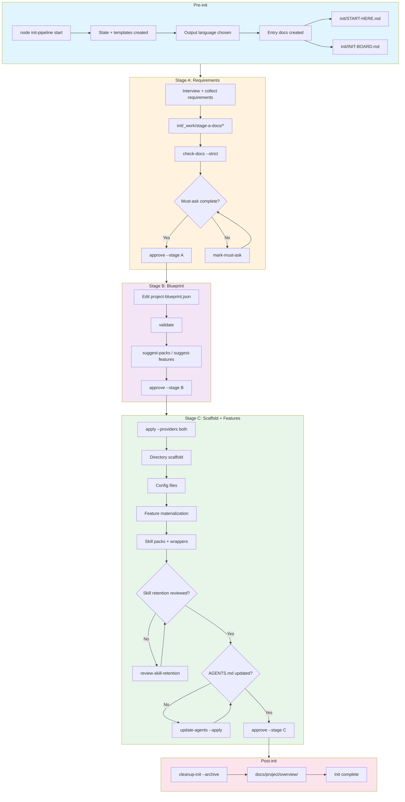

# Init kit (robust 3-stage pipeline)

> Human-facing documentation. If you are an LLM/AI assistant, skip the file to save tokens and follow `init/AGENTS.md` instead.

## Pipeline overview



## Start here (recommended)

After you run `start`, the init kit creates the working files (state + Stage A/B templates).
After the output language is chosen and recorded in the init state, the entry docs are created (copy-if-missing) and maintained by the LLM:

- Key input digest (LLM-maintained; localized): `init/START-HERE.md`
- Concise progress board (LLM-maintained; localized): `init/INIT-BOARD.md`
  - The init pipeline keeps a machine snapshot section refreshed after each pipeline command
  - LLM must not edit the machine snapshot markers/section

The `init/` package provides a 3-stage, checkpointed workflow to bootstrap a repository from requirements:

- **Stage A**: Requirements docs (working location: `init/_work/stage-a-docs/`)
- **Stage B**: Blueprint (working location: `init/_work/project-blueprint.json`)
- **Stage C**: Scaffold + configs + skill packs + features + wrapper sync + modular core build

It is designed for **robustness and auditability**:
- Each stage has a **validation step** (written into `init/_work/.init-state.json`)
- Stage transitions require **explicit user approval** (`approve` command)
- Optional features are **default-on**; set `features.<id>: false` to skip (DB and CI are controlled by `db.ssot` and `ci.provider`)

> **Working directory vs. final location**: During initialization, working files are stored under `init/_work/`. After completion, use `cleanup-init --archive` to archive to `docs/project/overview/`. See SKILL.md for details.

---

## Quick start (run from repo root)

### Command shortcuts (Node CLI)

Canonical CLI pattern:

- `node init/_tools/skills/initialize-project-from-requirements/scripts/init-pipeline.mjs <command> --repo-root .`

| Command | Shortcut |
|---------|----------|
| start | `node init/_tools/skills/initialize-project-from-requirements/scripts/init-pipeline.mjs start --repo-root .` |
| status | `node init/_tools/skills/initialize-project-from-requirements/scripts/init-pipeline.mjs status --repo-root .` |
| advance | `node init/_tools/skills/initialize-project-from-requirements/scripts/init-pipeline.mjs advance --repo-root .` |
| check-docs | `node init/_tools/skills/initialize-project-from-requirements/scripts/init-pipeline.mjs check-docs --repo-root . --strict` |
| validate | `node init/_tools/skills/initialize-project-from-requirements/scripts/init-pipeline.mjs validate --repo-root .` |
| apply | `node init/_tools/skills/initialize-project-from-requirements/scripts/init-pipeline.mjs apply --repo-root . --providers both` |
| approve Stage A | `node init/_tools/skills/initialize-project-from-requirements/scripts/init-pipeline.mjs approve --stage A --repo-root .` |
| approve Stage B | `node init/_tools/skills/initialize-project-from-requirements/scripts/init-pipeline.mjs approve --stage B --repo-root .` |
| approve Stage C | `node init/_tools/skills/initialize-project-from-requirements/scripts/init-pipeline.mjs approve --stage C --repo-root .` |
| review-skill-retention | `node init/_tools/skills/initialize-project-from-requirements/scripts/init-pipeline.mjs review-skill-retention --repo-root .` |
| update-agents | `node init/_tools/skills/initialize-project-from-requirements/scripts/init-pipeline.mjs update-agents --repo-root . --apply` |
| cleanup-init | `node init/_tools/skills/initialize-project-from-requirements/scripts/init-pipeline.mjs cleanup-init --repo-root . --apply --i-understand --archive` |

### 0) Initialize state
```bash
node init/_tools/skills/initialize-project-from-requirements/scripts/init-pipeline.mjs start --repo-root .
```

The command creates:
- `init/_work/AGENTS.md` - Workspace operating rules (generated by `start`, copy-if-missing)
- `init/_work/stage-a-docs/` - Stage A document templates
- `init/_work/project-blueprint.json` - Blueprint template
- `init/_work/.init-state.json` - State tracking file

After the output language is chosen and recorded in `init/_work/.init-state.json` (`outputLanguage`), the entry docs are created (copy-if-missing):

- `init/START-HERE.md` - LLM-maintained entry doc (localized; not SSOT)
- `init/INIT-BOARD.md` - LLM-maintained progress board (localized; contains a machine snapshot section refreshed after pipeline commands)

### Check progress / next checkpoint

```bash
# Current progress (prints guidance when not started yet)
node init/_tools/skills/initialize-project-from-requirements/scripts/init-pipeline.mjs status --repo-root .

# Next checkpoint actions (requires init state; exits non-zero if `start` was not run)
node init/_tools/skills/initialize-project-from-requirements/scripts/init-pipeline.mjs advance --repo-root .
```

### Preflight (recommended): terminology alignment

Before drafting Stage A docs, ask whether the user wants to align/confirm terminology now.

- If YES (sync): use `init/_work/stage-a-docs/domain-glossary.md` as the terminology SSOT and align terms across Stage A docs.
- If NO (skip): record the decision in `init/_work/stage-a-docs/domain-glossary.md` and continue.

See: `init/_tools/docs/stages/00-preflight-terminology.md`.

### 1) Stage A: validate docs -> approve
```bash
# Edit templates in init/_work/stage-a-docs/, then validate:
node init/_tools/skills/initialize-project-from-requirements/scripts/init-pipeline.mjs check-docs \
  --repo-root . \
  --strict

# Update the must-ask checklist (required by default before Stage A approval):
node init/_tools/skills/initialize-project-from-requirements/scripts/init-pipeline.mjs mark-must-ask \
  --repo-root . \
  --key <key> \
  --asked --answered \
  --written-to <path>

# After the user explicitly approves Stage A:
node init/_tools/skills/initialize-project-from-requirements/scripts/init-pipeline.mjs approve --stage A --repo-root .
```

### 2) Stage B: validate blueprint -> approve
```bash
# Edit init/_work/project-blueprint.json, then validate:
node init/_tools/skills/initialize-project-from-requirements/scripts/init-pipeline.mjs validate \
  --repo-root .

# Optional: report recommended packs/features
node init/_tools/skills/initialize-project-from-requirements/scripts/init-pipeline.mjs suggest-packs \
  --repo-root .
node init/_tools/skills/initialize-project-from-requirements/scripts/init-pipeline.mjs suggest-features \
  --repo-root .

# After the user explicitly approves Stage B:
node init/_tools/skills/initialize-project-from-requirements/scripts/init-pipeline.mjs approve --stage B --repo-root .
```

### 3) Stage C: apply scaffold/configs/packs/features/wrappers -> approve
```bash
node init/_tools/skills/initialize-project-from-requirements/scripts/init-pipeline.mjs apply \
  --repo-root . \
  --providers both
```

Safety: `apply` is Stage C only and refuses to run in earlier stages by default. Override (not recommended):

```bash
node init/_tools/skills/initialize-project-from-requirements/scripts/init-pipeline.mjs apply --repo-root . --providers both --force --i-understand
```

Before Stage C approval (required): review skill retention and record it in the init state:

```bash
node init/_tools/skills/initialize-project-from-requirements/scripts/init-pipeline.mjs review-skill-retention --repo-root .
```

After the user explicitly approves Stage C:

```bash
node init/_tools/skills/initialize-project-from-requirements/scripts/init-pipeline.mjs approve --stage C --repo-root .
```

### 4) Optional: cleanup after init

**Option A: Remove `init/` only** (Stage A docs and blueprint will be deleted)

```bash
node init/_tools/skills/initialize-project-from-requirements/scripts/init-pipeline.mjs cleanup-init \
  --repo-root . \
  --apply \
  --i-understand
```

**Option B: Archive to `docs/project/overview/` + remove `init/`** (recommended for retaining docs)

```bash
node init/_tools/skills/initialize-project-from-requirements/scripts/init-pipeline.mjs cleanup-init \
  --repo-root . \
  --apply \
  --i-understand \
  --archive
```

The command archives Stage A docs and the blueprint to `docs/project/overview/`, then removes `init/`.

---

## Blueprint anatomy

The blueprint schema is:

- `init/_tools/skills/initialize-project-from-requirements/templates/project-blueprint.schema.json`

Key sections:

- `project.*`: name, description, and domain basics
- `db.ssot`: database schema single-source-of-truth
  - `none` | `repo-prisma` | `database`
- `context.*`: context configuration (does not enable the feature by itself)
- `capabilities.*`: informs scaffold and pack selection
- `ci.provider`: CI provider selection (`none` | `github` | `gitlab`)
- `features.*`: feature overrides (default-on; set to `false` to skip materialization)

## Optional features

The init template ships many optional features. Prefer using:

- `init/INIT-BOARD.md` for a human-readable "what matters / what's missing" view
- `init/_tools/docs/feature-docs/README.md` for feature-specific details

<details>
<summary>Feature materialization details</summary>

Feature assets are integrated under `.ai/`:

- Feature skills + templates: `.ai/skills/features/...`
- Feature controllers: `.ai/skills/features/**/scripts/*` (Node/Python)
- Cross-cutting controllers: `.ai/scripts/*` (e.g., `projectctl.mjs`, `dbssotctl.mjs`)
- Project state (feature flags): `.ai/project/state.json`

Stage C `apply` materializes a feature by copying templates into the repo (when the feature has templates) and running the corresponding control scripts (typically under `.ai/skills/features/**/scripts/`, plus cross-cutting `.ai/scripts/projectctl.mjs` for feature state).

Note (Windows): `python3` may not exist on PATH. Use `python` instead. (Stage C `apply` will try `python3` then `python`.)

| Feature | Blueprint control | Materializes | Control script(s) |
|---------|------------------|--------------|----------------|
| Context awareness | **mandatory** (cannot be disabled) | `docs/context/**`, `config/environments/**` | `node .ai/skills/features/context-awareness/scripts/contextctl.mjs` |
| Database | `db.ssot` (`none` disables) | `db/**` (when `db.ssot=database`), `prisma/**` (when `db.ssot=repo-prisma`) | `.ai/skills/features/database/sync-code-schema-from-db/scripts/dbctl.mjs` (when `db.ssot=database`); `node .ai/skills/features/database/db-human-interface/scripts/dbdocctl.mjs` (human interface) |
| UI | `features.ui` (default: `true`) | `ui/**`, `docs/context/ui/**` | `python3 .ai/skills/features/ui/ui-system-bootstrap/scripts/ui_specctl.py` |
| Environment | `features.environment` (default: `true`) | `env/**` (+ generated non-secret docs when `--verify-features`) | `python3 .ai/skills/features/environment/env-contractctl/scripts/env_contractctl.py` |
| Packaging | `features.packaging` (default: `true`) | `ops/packaging/**`, `docs/packaging/**` | `node .ai/skills/features/packaging/scripts/packctl.mjs` |
| Deployment | `features.deployment` (default: `true`) | `ops/deploy/**` | `node .ai/skills/features/deployment/scripts/deployctl.mjs` |
| CI | `ci.provider` (`none` disables; default: `github`) | `.github/workflows/ci.yml` (GitHub) or `.gitlab-ci.yml` (GitLab), `ci/**` | `node .ai/skills/features/ci/scripts/cictl.mjs` |
| Observability | `features.observability` (default: `true`) | `docs/context/observability/**`, `observability/**` | `node .ai/skills/features/observability/scripts/obsctl.mjs` |
| Release | `features.release` (default: `true`) | `release/**`, `.releaserc.json.template` | `node .ai/skills/features/release/scripts/releasectl.mjs` |

</details>

For feature-specific details, see:

- `init/_tools/docs/feature-docs/README.md`
- `.ai/skills/features/<feature-id>/**/SKILL.md`

## Feature selection workflow (Stage B -> Stage C)

### Key rules

- Context awareness is always installed in Stage C (mandatory).
- Database enablement is controlled by `db.ssot`:
  - `db.ssot=none` skips all DB outputs
- CI enablement is controlled by `ci.provider`:
  - `ci.provider=none` skips all CI outputs
- Other features are enabled by default; set `features.<id>: false` to skip.
- Stage C is non-destructive: setting `features.<id>: false` later will NOT uninstall previously created files.

### Recommended steps

1) Fill `capabilities.*`, choose `db.ssot`, choose `ci.provider`, and set any feature overrides under `features.*` if needed.

2) Ask the pipeline for recommendations:

```bash
  node init/_tools/skills/initialize-project-from-requirements/scripts/init-pipeline.mjs suggest-features --repo-root .
  node init/_tools/skills/initialize-project-from-requirements/scripts/init-pipeline.mjs suggest-packs --repo-root .
```

## Apply flags (Stage C)

- `--force-features`: overwrite existing feature files when materializing templates
- `--verify-features`: run `*ctl.* verify` after `init` (respects `--blocking-features`)
- `--blocking-features`: fail-fast on feature init/verify errors (default is non-blocking)
- `--non-blocking-features`: (legacy) continue despite feature init/verify errors
- `--skip-modular`: skip modular core build (not recommended)
- `--blocking-modular`: fail-fast on modular core build errors (default is non-blocking)
